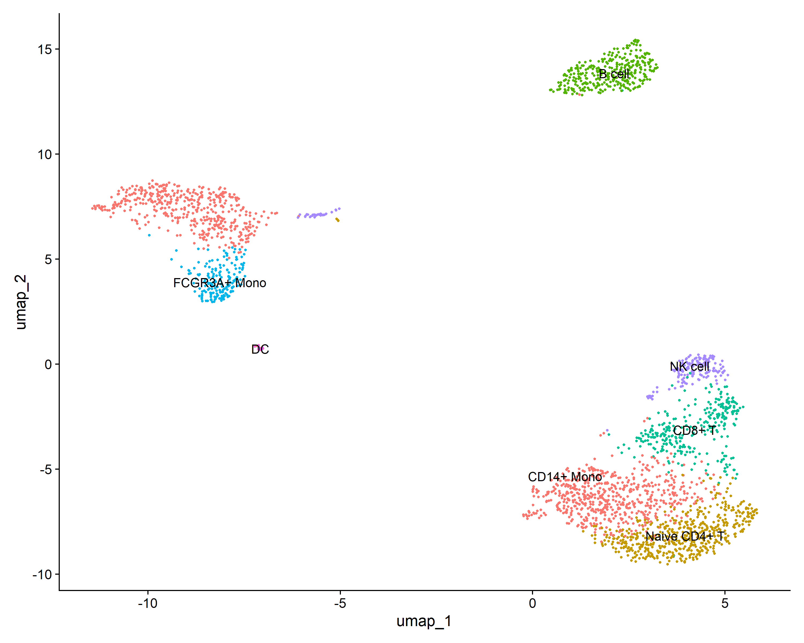
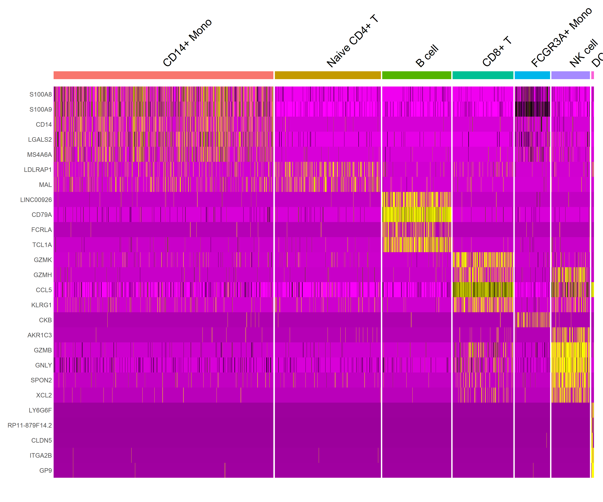
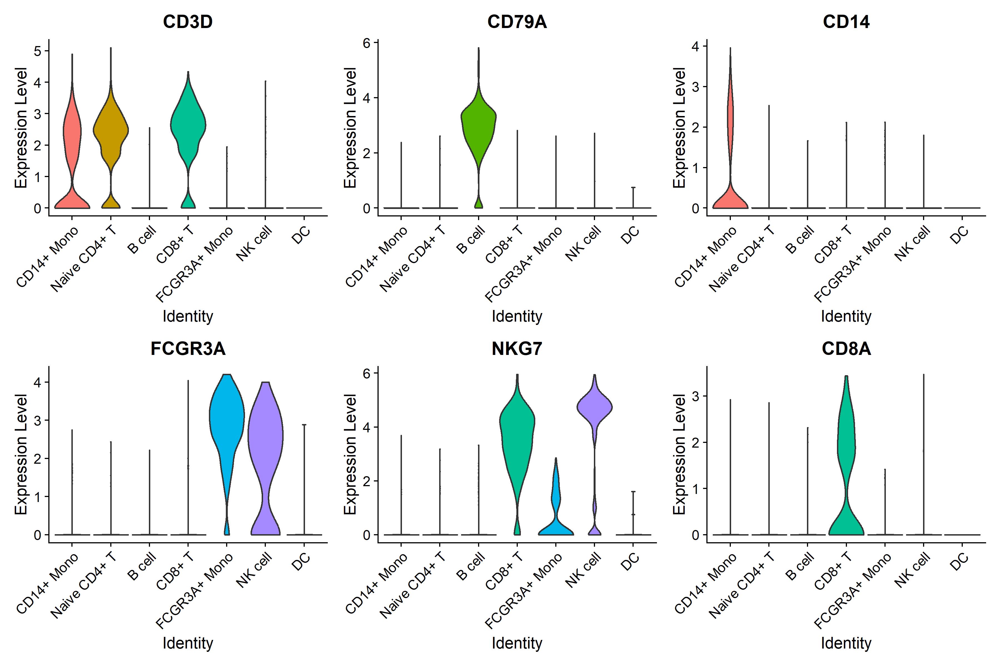
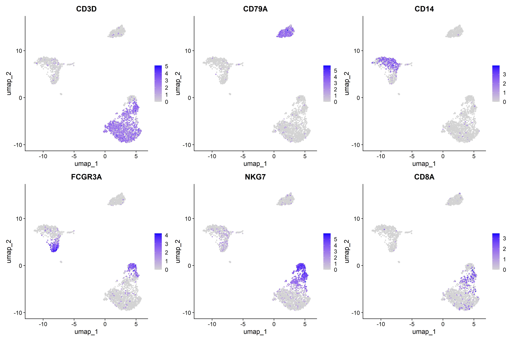
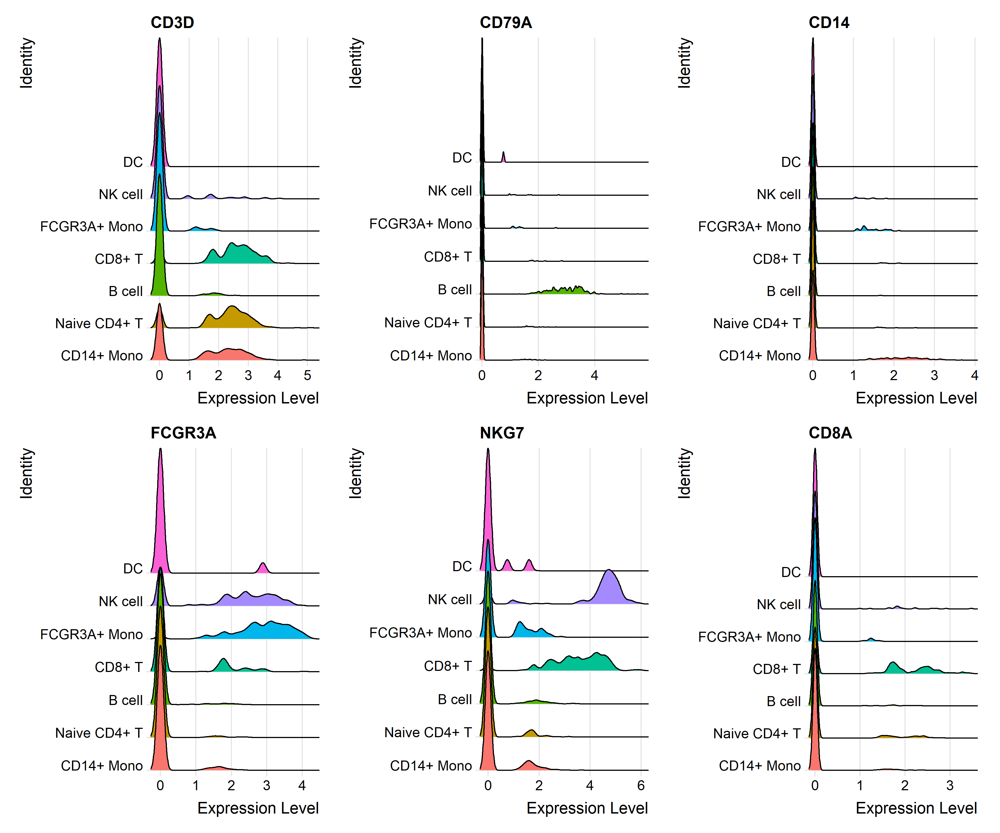
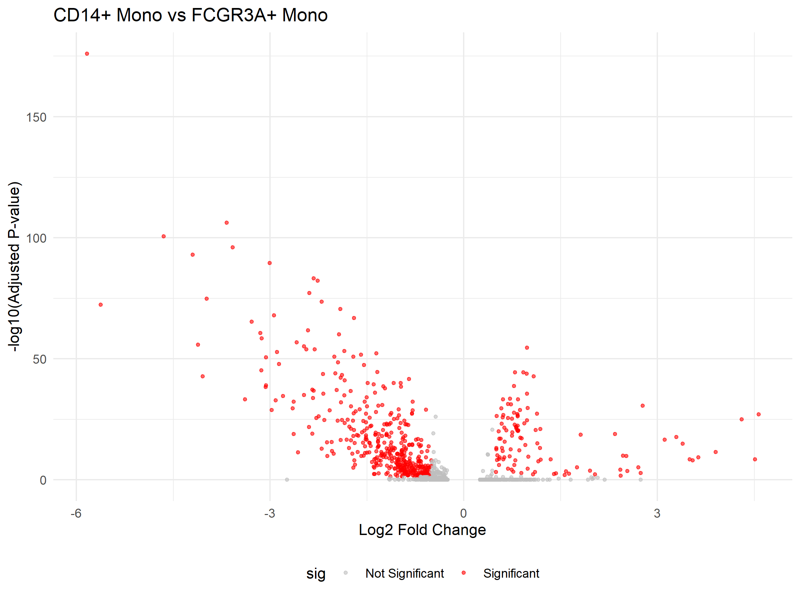
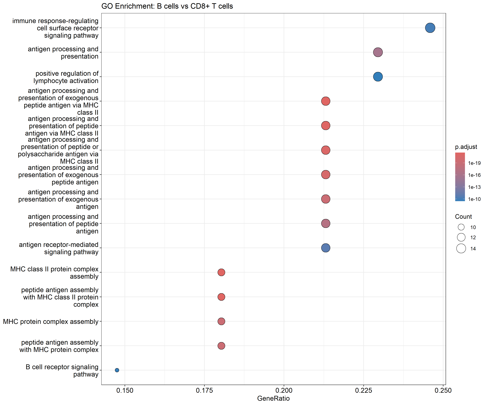

# PBMC3K 单细胞转录组数据分析（Seurat）

## 项目简介

本项目使用 10X Genomics 官方提供的 PBMC3K 数据集（2,700 个人类外周血单核细胞），基于 R 语言 Seurat 包完成了完整的单细胞转录组分析流程。通过对 2,700 个细胞的转录组数据进行质控、降维、聚类和注释，成功识别出 7 种主要的免疫细胞类型，并进行了差异表达分析和功能富集分析。

## 数据集

- **来源**：10X Genomics 官方 PBMC3K 数据集
- **细胞数量**：2,700 个
- **基因数量**：32,738 个
- **测序平台**：Illumina NextSeq 500

## 分析流程

原始数据 (10X Genomics)
↓
读取与质控
(过滤低质量细胞)
↓
标准化处理
(LogNormalize)
↓
高变基因筛选
(2,000个)
↓
PCA 降维
↓
UMAP 降维 + 图聚类
↓
细胞类型注释
(基于标记基因)
↓
差异表达分析
(单核细胞亚群)
↓
GO 功能富集分析
(B细胞 vs CD8+ T细胞)


## 分析结果

### 1. UMAP 细胞分群

基于 UMAP 降维和聚类算法，成功将 2,700 个细胞分为 7 个主要的细胞亚群：



**识别的细胞类型**：

| 细胞类型 | 说明 |
|---------|------|
| CD14+ Mono | 经典单核细胞 |
| Naive CD4+ T | 初始 CD4+ 辅助 T 细胞 |
| B cell | B 细胞 |
| CD8+ T | 细胞毒性 T 细胞 |
| FCGR3A+ Mono | 非经典单核细胞 |
| NK cell | 自然杀伤细胞 |
| DC | 树突状细胞 |

### 2. 标记基因热图

每个细胞类型的 top 5 标记基因表达热图：



*黄色表示高表达，紫色表示低表达。各细胞类型的标记基因特异性良好。*

### 3. 小提琴图

关键标记基因在各细胞类型中的表达分布：



| 基因 | 特异性表达的细胞类型 |
|------|-------------------|
| CD3D | T 细胞（Naive CD4+ T, CD8+ T） |
| CD79A | B 细胞 |
| CD14 | CD14+ 经典单核细胞 |
| FCGR3A | FCGR3A+ 非经典单核细胞、NK 细胞 |
| NKG7 | NK 细胞、CD8+ T 细胞 |
| CD8A | CD8+ T 细胞 |

### 4. 特征图

关键标记基因在 UMAP 空间中的表达分布：



*蓝色越深表示表达量越高，基因表达位置与细胞类型注释结果一致。*

### 5. 山脊线图

关键标记基因的表达密度分布：



*每个基因的峰值所在细胞类型与其注释一致。*

### 6. 差异表达分析：CD14+ Mono vs FCGR3A+ Mono

比较经典单核细胞（CD14+ Mono）与非经典单核细胞（FCGR3A+ Mono）的差异表达基因：



**关键发现**：
- CD14 在 CD14+ Mono 中显著高表达（log2FC > 4）
- FCGR3A 在 FCGR3A+ Mono 中显著高表达（log2FC < -3）
- 共识别出数百个显著差异表达基因（|log2FC| > 0.5, adj.p < 0.05）

### 7. GO 功能富集分析：B细胞 vs CD8+ T细胞

比较 B 细胞和 CD8+ T 细胞，识别与细胞功能相关的生物学通路：



**显著富集的通路**（p.adjust < 0.05）：

| 类别 | 通路 | 说明 |
|------|------|------|
| **抗原呈递** | antigen processing and presentation via MHC class II | 抗原加工与呈递 |
| **B 细胞功能** | B cell receptor signaling pathway | B 细胞受体信号通路 |
| | B cell activation | B 细胞活化 |
| | B cell proliferation | B 细胞增殖 |
| **T 细胞功能** | T cell receptor signaling pathway | T 细胞受体信号通路 |
| | T cell mediated cytotoxicity | T 细胞介导的细胞毒性 |
| | cell killing | 细胞杀伤 |
| **免疫调控** | lymphocyte activation | 淋巴细胞活化 |
| | immune response-activating signal transduction | 免疫响应信号转导 |

> *注：图中显示的是 p 值最显著的前 15 个通路。完整结果（包括 B cell activation、B cell proliferation 等）见 `results/go_enrichment_results.csv`。*

## 文件说明

| 文件 | 说明 |
|------|------|
| `pbmc3k_analysis.R` | 完整分析代码（R 脚本） |
| `results/umap_pbmc3k_final.png` | UMAP 细胞分群图 |
| `results/heatmap.png` | 标记基因热图 |
| `results/violin_plot.png` | 小提琴图 |
| `results/feature_plot.png` | 特征图 |
| `results/ridge_plot.png` | 山脊线图 |
| `results/volcano_plot.png` | 火山图 |
| `results/go_enrichment.png` | GO 富集图 |
| `results/marker_genes.csv` | 标记基因完整列表 |
| `results/go_enrichment_results.csv` | GO 富集完整结果 |

## 运行方式

### 环境要求

- R 4.5.1
- Seurat 5.4.0
- clusterProfiler
- org.Hs.eg.db

### 运行代码

```r
# 克隆仓库后，在 R/RStudio 中运行
source("pbmc3k_analysis.R")

环境

工具	版本
R	4.5.1
Seurat	5.4.0
clusterProfiler	4.15.0
org.Hs.eg.db	3.21.0

结论

本项目成功完成了 PBMC3K 单细胞数据的完整分析：

1. 细胞类型识别：通过 UMAP 降维和聚类，成功识别出 7 种主要的免疫细胞类型

2. 标记基因验证：通过热图、小提琴图、特征图等多种可视化方式，验证了细胞类型注释的准确性

3. 差异表达分析：比较两种单核细胞亚型，识别出 CD14 和 FCGR3A 等关键差异基因

4. 功能富集分析：比较 B 细胞和 CD8+ T 细胞，富集出 MHC II 抗原呈递、B/T 细胞受体信号通路、细胞杀伤等核心功能通路

参考文献

1. Hao, Y., et al. (2024). Dictionary learning for integrative, multimodal and scalable single-cell analysis. Nature Biotechnology.

2. 10X Genomics. PBMC3K Dataset. Data available at: https://cf.10xgenomics.com/samples/cell/pbmc3k/pbmc3k_filtered_gene_bc_matrices.tar.gz